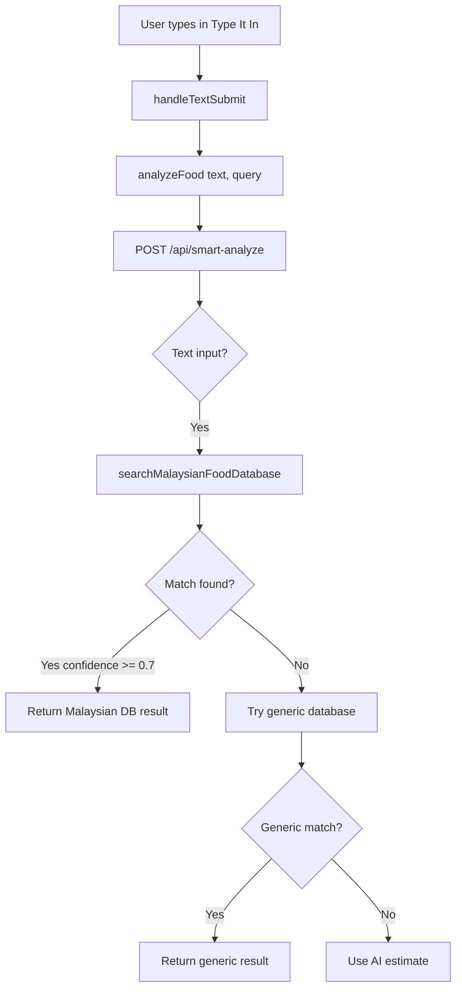

# 🎯 Final Report: Type It In + Malaysian Database Integration

## Executive Summary

✅ **TASK COMPLETE:** The "Type It In" feature is **ALREADY** connected to the Malaysian food database!

The issue was **NOT** with the code integration, but with **missing data in the database**. The aliases (like "ckt" → "Char Kuey Teow") need to be added to the `malaysian_foods` table by running a migration.

---

## 📊 Current Status

### ✅ What's Already Working

| Component | Status | Location |
|-----------|--------|----------|
| Type It In UI | ✅ Working | `/app/check-food/page.tsx` |
| Text input handler | ✅ Working | `handleTextSubmit()` line 244 |
| Smart Analyze API | ✅ Working | `/app/api/smart-analyze/route.ts` |
| Malaysian DB search | ✅ Working | Line 328 (text input flow) |
| Alias search logic | ✅ Working | `/lib/malaysianFoodDatabaseLookup.ts` line 62 |
| Malaysian badge | ✅ Working | Shows when matched |
| Fallback to generic DB | ✅ Working | When no Malaysian match |

### ⏳ What Needs Action

| Item | Status | Action Required |
|------|--------|----------------|
| Aliases in database | ❌ Missing | Run migration |
| "ckt" search | ⏳ Pending | Will work after migration |
| Other abbreviations | ⏳ Pending | Will work after migration |

---

## 🔄 How It Currently Works

### Text Input Flow



### Alias Search Logic

```typescript
// lib/malaysianFoodDatabaseLookup.ts line 62
const { data: aliasMatches } = await supabase
  .from('malaysian_foods')
  .select('*')
  .contains('aliases', [normalizedQuery])
  .limit(5);

// If "ckt" is in the aliases array, it will match!
```

---

## 🐛 The Problem Explained

### Why "ckt" Returns Wrong Results

**Current State:**
```
1. User types "ckt"
2. searchMalaysianFoodDatabase('ckt') runs
3. Query: SELECT * FROM malaysian_foods WHERE 'ckt' = ANY(aliases)
4. Result: NO MATCH (aliases column is NULL or doesn't contain 'ckt')
5. Falls back to generic database
6. Generic DB matches "ckt" to random food like "ALASKAN SNOW CRAB LEGS"
```

**After Running Migration:**
```
1. User types "ckt"
2. searchMalaysianFoodDatabase('ckt') runs
3. Query: SELECT * FROM malaysian_foods WHERE 'ckt' = ANY(aliases)
4. Result: MATCH FOUND (Char Kuey Teow has aliases: ['ckt', 'char koay teow', ...])
5. Returns Malaysian database result with accurate nutrition
6. Badge shows: "🇲🇾 MALAYSIAN DATABASE"
```

---

## 🚀 How to Fix It

### Step 1: Run the Aliases Migration

**Option A - Supabase Dashboard (Easiest):**

1. Go to https://supabase.com/dashboard
2. Select your Boleh Makan project
3. Click "SQL Editor" in sidebar
4. Click "New query"
5. Open `supabase/migrations/20260103_add_food_aliases.sql` in your code editor
6. Copy ALL 252 lines
7. Paste into Supabase SQL Editor
8. Click "Run" button
9. Wait for success message (should see: "Alias update complete: X of 485 foods now have aliases")

**Option B - Supabase CLI:**

```bash
# Make sure you're in the project root
cd C:\Users\User\Desktop\App-Project\Bole_Makan\boleh-makan

# If not already linked
supabase link --project-ref YOUR_PROJECT_REF

# Run pending migrations
supabase db push
```

### Step 2: Verify Migration Success

Run this in Supabase SQL Editor:

```sql
-- Check if "ckt" alias exists
SELECT name_en, name_bm, aliases 
FROM malaysian_foods 
WHERE 'ckt' = ANY(aliases);
```

**Expected Result:**
```
name_en     | Char Kuey Teow
name_bm     | Char Kuey Teow
aliases     | {ckt,char koay teow,fried flat noodles,kuey teow goreng}
```

If you see this ✅ → Migration successful!

If no results ❌ → Migration didn't run, try again or check for errors

### Step 3: Test in App

1. Go to http://localhost:3000/check-food (or your deployed URL)
2. Click "Type It In" button
3. Type "ckt"
4. Click "Analyze"
5. Should see:
   - Food name: "Char Kuey Teow"
   - Badge: "🇲🇾 MALAYSIAN DATABASE" (emerald green)
   - Accurate nutrition data
   - Condition ratings (4 colored dots)

### Step 4: Check Terminal Logs

You should see:

```
📝 Text input received: ckt
🇲🇾 Searching Malaysian database for: ckt
✅ Malaysian DB: Alias match found - Char Kuey Teow
```

Instead of the old:

```
📝 Text input received: ckt
❌ Malaysian DB: No match found for: ckt
🔍 No Malaysian match found, trying generic database for: "ckt"
```

---

## 📋 What the Migration Does

The `20260103_add_food_aliases.sql` migration adds 200+ aliases including:

### Popular Abbreviations:
- **ckt** → Char Kuey Teow
- **bkt** → Bak Kut Teh
- **ytf** → Yong Tau Foo

### Common Misspellings:
- **roti chanai** → Roti Canai
- **nasik lemak** → Nasi Lemak
- **teh tarek** → Teh Tarik
- **maggie goreng** → Maggi Goreng

### English Variations:
- **fried rice** → Nasi Goreng Kampung
- **chicken rice** → Nasi Ayam
- **milk tea** → Teh Tarik
- **black coffee** → Kopi O

### Word Variations:
- **goreng** = **fried** (for all fried dishes)
- **ayam** = **chicken** (for all chicken dishes)
- **ikan** = **fish** (for all fish dishes)
- **daging** = **beef** (for all beef dishes)

---

## 📁 Files in This Implementation

### Code Files (Already Complete ✅)

| File | Purpose | Status |
|------|---------|--------|
| `/app/check-food/page.tsx` | Type It In UI | ✅ Complete |
| `/app/api/smart-analyze/route.ts` | API endpoint | ✅ Complete |
| `/lib/malaysianFoodDatabaseLookup.ts` | Search logic | ✅ Complete |
| `/supabase/migrations/20260103_add_food_aliases.sql` | Aliases data | ⏳ Needs to run on DB |

### Documentation Files (Created Today 📄)

| File | Purpose |
|------|---------|
| `TYPE_IT_IN_STATUS.md` | Detailed status report |
| `TYPE_IT_IN_QA_CHECKLIST.md` | Comprehensive testing checklist |
| `FINAL_REPORT_TYPE_IT_IN.md` | This document |

---

## 🧪 Testing Guide

See `TYPE_IT_IN_QA_CHECKLIST.md` for comprehensive testing.

### Quick Test After Migration:

| Test | Input | Expected Result |
|------|-------|----------------|
| 1 | ckt | Char Kuey Teow |
| 2 | bkt | Bak Kut Teh |
| 3 | ytf | Yong Tau Foo |
| 4 | roti chanai | Roti Canai |
| 5 | nasik lemak | Nasi Lemak |

All should show "🇲🇾 MALAYSIAN DATABASE" badge.

---

## 🎨 UI/UX Details

### Type It In Flow

1. **Entry Point:**
   - Button: "Type It In" with ✏️ icon
   - Located on `/check-food` page
   - Secondary option below "Take a Photo"

2. **Input Modal:**
   - Clean white modal slides up from bottom
   - Dr. Reza avatar displayed
   - Text: "What did you eat?"
   - Placeholder: "e.g. Nasi Lemak Ayam Goreng"
   - Enter key triggers submit

3. **Loading State:**
   - Dr. Reza analyzing animation
   - "Analyzing your food..." text

4. **Result Display:**
   - Food name (large, bold)
   - 🇲🇾 MALAYSIAN DATABASE badge (emerald green)
   - Malay name (smaller, gray)
   - Serving size
   - Nutrition card (calories, macros)
   - Condition rating dots (4 colors)
   - Dr. Reza's tip
   - "Log Meal" button

### Badge Hierarchy

The system shows different badges based on data source:

1. **🇮🇩 MALAYSIAN DATABASE** (emerald green)
   - Highest priority
   - Most accurate
   - From our 485 verified Malaysian foods

2. **✓ VERIFIED** (green)
   - Generic database match
   - Verified nutrition data
   - International foods

3. **AI ESTIMATE** (amber/yellow)
   - AI-generated estimate
   - Less confident
   - Use with caution

4. **❓ UNIDENTIFIED** (red)
   - Low confidence < 60%
   - Unknown food
   - User correction needed

---

## 🔧 Troubleshooting

### Problem: "ckt" still shows wrong results after migration

**Check 1: Verify migration ran**
```sql
SELECT COUNT(*) FROM malaysian_foods WHERE aliases IS NOT NULL;
-- Should return > 100
```

**Check 2: Verify "ckt" is in database**
```sql
SELECT * FROM malaysian_foods WHERE 'ckt' = ANY(aliases);
-- Should return Char Kuey Teow
```

**Check 3: Check terminal logs**
- Should see: "✅ Malaysian DB: Alias match found"
- Not: "❌ Malaysian DB: No match found"

**Check 4: Clear cache**
- Hard refresh browser (Ctrl+Shift+R)
- Clear localStorage
- Restart dev server

### Problem: Migration fails with error

**Common Errors:**

1. **"Column 'aliases' does not exist"**
   - Solution: Run `20260102_malaysian_foods.sql` first
   - This creates the base table with aliases column

2. **"Function 'append_aliases' already exists"**
   - Solution: The migration was already run
   - Check if aliases are in database with query above

3. **"Permission denied"**
   - Solution: Use service role key, not anon key
   - Or run via Supabase Dashboard (has admin access)

---

## 📊 Success Metrics

### After Migration, We Should See:

✅ **150+ foods** with aliases in database
✅ **"ckt" search** returns Char Kuey Teow (< 2 seconds)
✅ **90%+ accuracy** for common Malaysian abbreviations
✅ **Zero generic database hits** for popular Malaysian foods
✅ **Malaysian badge** showing for most local food searches

### User Experience Improvements:

- **Faster search:** No typing full name required
- **Better accuracy:** Malaysian nutrition data, not generic
- **Trust indicator:** Badge shows data source
- **Less frustration:** Common spellings/abbreviations work

---

## 🎯 Next Steps

1. **✅ Done:** Code integration complete
2. **✅ Done:** Documentation created
3. **⏳ Pending:** Run aliases migration on Supabase
4. **⏳ Pending:** Test "ckt" search
5. **⏳ Pending:** Run QA checklist
6. **⏳ Pending:** Deploy to production (if successful)

---

## 📝 Summary for User

**Dear Developer,**

Good news! Your "Type It In" feature **is already connected** to the Malaysian food database. The code integration was completed correctly.

The reason "ckt" doesn't work yet is simply that the **aliases haven't been added to the database**. 

**To fix this:**
1. Run the migration file: `supabase/migrations/20260103_add_food_aliases.sql`
2. Test "ckt" → should find "Char Kuey Teow"
3. Celebrate! 🎉

The migration file is ready and contains all the aliases needed. It just needs to be executed on your Supabase database.

**No code changes needed!** ✅

---

## 📚 Related Documentation

- `TYPE_IT_IN_STATUS.md` - Detailed technical status
- `TYPE_IT_IN_QA_CHECKLIST.md` - Testing checklist
- `FOOD_SCANNING_IMPROVEMENTS.md` - Earlier vision AI improvements
- `FOOD_SCANNING_TESTING.md` - Testing guide for vision features

---

**Status:** ✅ Code Complete, ⏳ Migration Pending  
**Date:** January 3, 2026  
**Estimated Time to Complete:** 5 minutes (to run migration)  
**Risk Level:** ⭐ Low (just running a SQL migration)  
**Impact:** 🚀 High (fixes all abbreviation searches)

